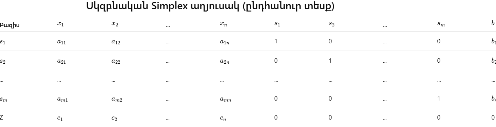
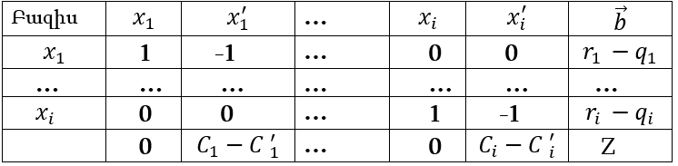
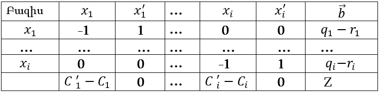

#  Ներածություն

Արևային էներգիան Հայաստանում սկսել է շատ արագ զարգանալ վերջին 15
տարիների ընթացքում: Իրականում Հայաստանի Հանրապետությունը էներգետիկ
ռեսուրսների տեսանկյունից կարող է թվալ ոչ այդքան հարուստ երկիր, բայց
արևի, տարվա ընթացքում արևոտ օրերի և արևային էներգիայի տեսանկյունից այն
տարածաշրջանում ամենահարուստներից է: Արևային էներգիան դեռ նոր է սկսել թափ
հավաքել և հաստանուն քայլերով օգնում է Հայաստանին շարժվել դեպի ավելի
կանաչ ապագա և պահպանել բնությունը:\
Փոքր և միջին տեխնոլոգիական ընկերությունների համար պատկառելի
մտահոգություն է աշխատանքի ընթացքում արտադրական ծախսերի վերահսկումը,
դրանց կողմից իրականացվող տեղական միկրոհամակարգերի ներդրումը (արևային
պանելներ, ցանցային միացում, էներգիան կուտակող համակարգեր) թույլ է տալիս
նվազեցնել հիմնական ծախսերը և բարձրացնել կայունությունը՝ հատկապես այն
ժամերին, երբ էլեկտրաէներգիայի ցանցային գինը աճում է։

Այս դիպլոմային աշխատանքի թեման հետևյալն է, Երևանում գործող տեխնոլոգիական
ընկերությունն ունի տանիքի արևային ֆոտովոլտային կայան, միացված է
«Հայաստանի էլեկտրական ցանցեր» (ՀԷՑ) ցանցին, և օգտագործում է մարտկոցային
պահեստ (energy storage)։ ՀԾԿՀ սահմանող օրինաչափությունների պատճառով
սպառման սակագինը օրվա ընթացքում ժամանակայնորեն փոփոխական է՝ ցերեկը թանկ
և գիշերը՝ ավելի էժան։ Ընկերության նպատակը՝ նվազագույնի հասցնել ամսական
էլեկտրաէներգիայի ծախսերը՝ օպտիմալացնել ցանցից գնված էներգիան, տանիքի
արևային ֆոտովոլտիկ արտադրանքը և մարտկոցի լիցք/ապալիցք գործելաոճը։

Օպտիմալացման համար անհրաժեշտ է զարգացնել մաթեմատիկական մոդել և լուծման
ալգորիթմ, որը ժամային մակարդակում կընտրի ամենաարդյունավետ
էներգամատակարարման կոմբինացիան՝ հաշվի առնելով սակագները, PV-ի
արտադրանքը, ընկերության բեռը և մարտկոցի ֆիզիկամաթեմատիկական հարթակները
(սահմանափակումներ, արդյունավետություններ, մաշվածության ծախս \`
degradation )։

# Գլուխ 1. Վերլուծական ակնարկ։

## 1.1 Համակարգերի հետազոտություն:

Վերջին տասնամյակում աշխարհի բազմաթիվ երկրներում աճել է հետաքրքրությունը
տեղական էներգահամակարգերի (microgrid) նկատմամբ։ Այս համակարգերը
համակցում են արևային ֆոտովոլտային վահանակները, էլեկտրաէներգիայի
կուտակիչները և կենտրոնացված էլեկտրացանցը՝ նպատակ ունենալով բարձրացնել
էներգետիկ արդյունավետությունը, նվազեցնել ծախսերը և մեծացնել էներգետիկ
անկախությունը։ Հետազոտությունների մեծ մասը ցույց է տալիս, որ նման
համակարգերի արդյունավետ շահագործման համար անհրաժեշտ է ճիշտ օպտիմիզացում՝
հաշվի առնելով սակագների ժամային կառուցվածքը, մարտկոցների
հնարավորությունները և սպառման գրաֆիկը։\
Մեքենայական ուսուցման ալգորիթմների վրա հիմնված ախտորոշիչ համակարգերը
վերջին տարիներին դարձել են առողջապահության զարգացման առանցքային
ուղղություններից մեկը։ Դրանք հնարավորություն են տալիս վերլուծել
պատկերային, ախտանշանային և լաբորատոր տվյալներ՝ ապահովելով արագ, ճշգրիտ և
տվյալահեն որոշումներ։\
\
**1. Արևային ֆոտովոլտային կայաններ և ցանց (on-grid):**

Արևային ֆոտովոլտային կայանները, որոնք միացված են էլեկտրացանցին, այսօր
ամենատարածված լուծումներից են թե՛ մասնավոր տներում, թե՛ խոշոր
արդյունաբերական օբյեկտներում։ Դրանց հիմնական գաղափարը բավական պարզ է
արևային պանելները արտադրում են էլեկտրաէներգիա, իսկ այդ էներգիան
անմիջապես օգտագործվում է սպառողների կողմից։ Եթե տվյալ պահին արտադրանքը
բավարար չէ, պակասող մասը գալիս է ցանցից, իսկ եթե ավել է՝ կարող է մուտք
գործել ցանց (net metering համակարգ ունեցող երկրներում) կամ ուղղակի չի
օգտագործվում, եթե հանրապետությունում նման մեթոդ չկա։

On-grid համակարգերը առանձնանում են նրանով, որ դրանք չեն պահանջում
մարտկոցներ։ Սա մեծ առավելություն է, քանի որ մարտկոցները թանկ են, մաշվում
են, և ընդհանուր համակարգի արժեքն ու սպասարկման բարդությունը զգալիորեն
մեծացնում են։ On-grid տարբերակում inverter-ը իրականացնում է "խելացի"
կառավարում՝ համադրելով արևային կայանի արտադրանքը և ցանցից մատակարարվող
էներգիան։

-   Դրա շնորհիվ արևի ակտիվ ժամերին սպառողը մեծ մասամբ աշխատում է սեփական
    արտադրած էներգիայով, ինչի արդյունքում նվազում է էլեկտրաէներգիայի
    ամսական վճարը։

-   Իսկ գիշերը կամ ամպամած օրերին ամբողջ ծանրաբեռնվածությունը
    տեղափոխվում է ցանցի վրա։

On-grid համակարգերի կարևոր առանձնահատկություններից է դրանց բարձր
արդյունավետությունը։ Քանի որ չկա մարտկոցի լիցքավորման և արտալիցքավորման
կորուստ, արևային կայանի արտադրած գրեթե ամբողջ էներգիան անմիջապես օգտակար
է դառնում։ Բացի դրանից, inverter-ները մշտապես ապահովում են
էլեկտրաէներգիայի որակը՝ հավասարեցնելով լարումը և հաճախականությունը ցանցի
պարամետրերին, ինչը թույլ է տալիս համակարգին աշխատել կայուն և անվտանգ։

Ի տարբերություն autonom կամ off-grid լուծումների՝ այս տարբերակը չի
ապահովում էներգիայի անկախություն հոսանքազրկման ժամանակ, քանի որ
inverter-ը անվտանգային նկատառումներով անջատվում է, եթե ցանցը բացակայում
է։ Դա արվում է, որպեսզի արևային կայանը հոսանք չտա վնասված գծին, որտեղ
կարող են աշխատել էլեկտրիկները։ Սակայն այս սահմանափակումը կարելի է լուծել
hybrid inverter + մարտկոցների միջոցով, եթե երբևէ ցանկություն առաջանա
համալրել համակարգը պահեստավորմամբ։

Ընդհանրապես on-grid արևային կայանները համարվում են ամենաարդյունավետ
ներդրումը էներգետիկ ծախսերը նվազեցնելու համար։ Դրանք գրեթե սպասարկում
չեն պահանջում և երկար տարիներ ապահովում են կայուն աշխատանք։ Հիմնականում
փոփոխության ենթակա միակ մասերը inverter-ն ու մալուխային միացություններն
են, իսկ պանելները պահպանում են աշխատանքային ունակությունը 25--30 տարի։

**2. Արևային կայան և մարտկոցային կուտակիչներ(microgrid):**

Միկրոհամակարգը ինքնավար էներգետիկ ենթակառուցվածք է, որն իր մեջ միավորում
է արտադրող կայաններ (օրինակ՝ արևային ֆոտովոլտային համակարգ), էներգիայի
կուտակիչներ, ինչպես նաև սպառողներ։ Այն կարող է աշխատել ինչպես
կենտրոնացված էլեկտրաէներգետիկ ցանցի հետ փոխկապակցված («on-grid» ռեժիմ),
այնպես էլ առանձին՝ ինքնաբավ («island mode»):

On-grid պայմաններում միկրոհամակարգի աշխատանքը հիմնվում է էներգիայի
հոսքերի ճշգրիտ պլանավորման վրա։ Յուրաքանչյուր ժամանակային հատվածում
միկրոհամակարգի կառավարման համակարգը կատարում է հաշվարկ, որի նպատակն է
նվազագույնի հասցնել էլեկտրաէներգիայի ծախսերը՝ միաժամանակ ապահովելով
պահանջվող հզորությունը։ Արտադրության և սպառման անընդհատ փոփոխվող
հավասարակշռությունը պահանջում է օպտիմալ որոշումներ՝ ինչքան հոսանք
վերցնել ցանցից, ինչքան օգտագործել արևային կայանից և արդյոք պետք է
լիցքավորել կամ օգտագործել մարտկոցը։

Միկրոհամակարգերի աշխատանքի առանցքային սկզբունքը տեղային արտադրության
առաջնահերթ օգտագործումն է։ Քանի որ արևային ֆոտովոլտային համակարգը
արտադրում է «զրոյական սահմանային արժեքի» էներգիա, կառավարման ալգորիթմը
նախ ընտրում է հենց այդ աղբյուրը։ Սակայն արևային էներգիայի փոփոխական
բնույթը՝ կախված արևային ճառագայթման տատանումներից, պահանջում է
պահուստային կառավարում։ Այդ դերակատարումն իրականացնում է մարտկոցը, որը
կլանում է ավելցուկը և ապահովում է էներգիայի վերադարձ այն ժամերին, երբ
արևային արտադրանքը նվազում է։

Կառավարման համակարգը նույն պահին առաջնորդվում է ոչ միայն ֆիզիկական, այլև
տնտեսական չափանիշներով։ Օրինակ՝ ժամային վարձավճարների առկայությունը
ստեղծում է լրացուցիչ օպտիմալացման պահանջ։ Գիշերային էժան ժամերին
համակարգը կարող է լիցքավորել մարտկոցը ցանցից, իսկ օրվա պիկ ժամերին այն
կարող է օգտագործել այդ կուտակած էներգիան՝ խուսափելով բարձր սակագնից։
Այսպիսով, միկրոհամակարգը գործում է որպես էներգետիկ միջավայր, որտեղ
տնտեսագիտական և տեխնիկական որոշումները միավորված են։

Վթարային կամ արտակարգ իրավիճակներում միկրոհամակարգը կարող է արագ անցնել
«islanding mode», այսինքն՝ ժամանակավորապես անջատվել կենտրոնացված ցանցից
և շարունակել աշխատել միայն տեղական ռեսուրսներով։ Այդ դեպքում մարտկոցն
ապահովում է համակարգի կայունությունը՝ պահելով լարման և հաճախականության
պահանջվող սահմանները։ Թեև այս ռեժիմը Հայաստանի համար հիմնականում
պահեստային բնույթ ունի, այն nonetheless բարձրացնում է էներգետիկ
անվտանգությունը։

Ընդհանուր առմամբ, միկրոհամակարգի աշխատանքի արդյունավետությունը որոշվում
է նրանից, թե որքան ճշգրիտ է մոդելավորված արտադրությունը, սպառումը և
սակագներն, ինչպես նաև՝ ինչպես է իրականացվում այդ երեք տարրերի համատեղ
օպտիմալ կառավարումը։ Ահա այստեղ է, որ մաթեմատիկական օպտիմալացման մոդելը
դառնում է համակարգի «ուղեղը», ապահովելով նվազագույն ծախս և առավելագույն
կայունություն։

**3. Արևային կայան և էներգիայի պահեստավորում ոչ մարտկոցային
եղանակներով**

Թեև արևային ֆոտովոլտային կայանների աշխատանքի ամենատարածված լրացուցիչ
ենթակառուցվածքը մարտկոցային էներգապահեստներն են, միջազգային փորձը ցույց
է տալիս, որ ոչ մարտկոցային պահեստավորման տեխնոլոգիաները կարող են լինել
նույնքան արդյունավետ՝ կախված տարածքի բնութագրերից, սպառման պրոֆիլից և
տնտեսական նպատակներից։ Այսպիսի լուծումները թույլ են տալիս արևային կայանի
արտադրած ավելցուկ էներգիան փոխակերպել այլ էներգետիկ ձևերի՝ ջերմային,
մեխանիկական կամ պոտենցիալ, որոնք հետագայում կարող են վերադառնալ
էլեկտրաէներգիայի կամ այլ օգտակար աշխատանքի տեսքով։

Հիդրոէներգետիկ փոխակերպումը մնում է ոչ մարտկոցային պահեստավորման
ամենաարդյունավետ և լայն կիրառվող օրինակներից մեկը։ Այն հիմնված է
պոմպ-կուտակային սկզբունքի վրա՝ երբ ավելցուկ էլեկտրաէներգիայի դեպքում
ջուրը բարձրացվում է վերին ջրամբար, ձևավորելով պոտենցիալ էներգիայի պաշար։
Արտադրության անկման դեպքում ջուրը իջնում է դեպի ստորին մակարդակ՝
պտտեցնելով տուրբինները և վերականգնելով էլեկտրաէներգիան։ Չնայած այդ
համակարգի կառուցվածքային խոշորածավալ բնույթին, այն արդյունավետ է և կարող
է հասնել մինչև 70--80% ամբողջական ցիկլի արդյունավետության։

Ոչ մարտկոցային պահեստավորման մյուս գործնական մոտեցումը ջերմային
սեզոնային պահեստավորումն է, որը հատկապես հետաքրքիր է հայկական կլիմայական
պայմաններում։ Արևային կայանի ավելցուկ արտադրանքը կարող է օգտագործվել
ջրի, շենքի զանգվածային տարրերի կամ հողի խորքային շերտերի տաքացման համար։
Նման համակարգերը թույլ են տալիս պահպանել ջերմային էներգիան շաբաթներով
կամ ամիսներով՝ նվազեցնելով ջեռուցման ծախսերը ձմռան շրջանում։ Թեպետ այս
մեխանիզմը չի վերականգնում էլեկտրաէներգիա, այն nonetheless էներգաբալանսի
ընդհանուր տեսանկյունից կատարում է նույն նպատակային ֆունկցիան՝
նվազեցնելով սպառումը բարձր սակագնի ժամերին։

Ավելացած էներգիան կարող է նաև կիրառվել անմիջական օգտակար աշխատանքի
վերածելու համար՝ օրինակ՝ ջրի պոմպավորում, օդի սեղմում կամ մեխանիկական
լիցքավորման այլ ձևեր։ Այս լուծումները, ի տարբերություն մարտկոցների, չեն
ունենում քիմիական մաշվածություն, և դրանց արդյունավետությունը հաշվարկվում
է հիմնականում մեխանիկական կորուստներով։ Դրանք հաճախ ավելի մատչելի են
երկարաժամկետ հեռանկարում, քանի որ չեն պահանջում թանկարժեք լիթիումային
բաղադրիչներ և ունեն երկարատև շահագործման ժամկետ։

Միկրոհամակարգերի համատեքստում նման պահեստավորման մեթոդները կարող են
ինտեգրվել արևային կայանի հետ՝ ձևավորելով հիբրիդային կառավարման սխեմա։
Այս մոտավորեցումը նվազեցնում է մարտկոցների չափը կամ նույնիսկ վերացնում է
դրանց անհրաժեշտությունը՝ ապահովելով կայուն և տնտեսապես արդյունավետ
էներգամատակարարում։ Հատկապես արդյունաբերական կամ գյուղատնտեսական
օբյեկտներում՝ որտեղ ջրի պոմպավորումը կամ ջերմային էներգիայի պահանջարկը
մեծ է, ոչ մարտկոցային պահեստավորումն ավելի ռացիոնալ լուծում է, քան
դասական մարտկոցային համակարգերը։

## 1․2 Մաթեմատիկական մոդելի կառուցման հիմքերը։ 

Էլեկտրաէներգիայի մատակարարման օպտիմալ կառավարման մոդելը կառուցվում է
համակարգի բոլոր բաղադրիչների՝ արևային կայանի արտադրության, ցանցից ձեռք
բերվող էներգիայի, սպառման, ինչպես նաև պահեստավորման մեխանիզմների
քանակական նկարագրության միջոցով։ Մոդելի հիմքում ընկած է այն գաղափարը, որ
յուրաքանչյուր ժամանակային հատվածում անհրաժեշտ է կատարել որոշում՝ ինչ
աղբյուրից է առավել նպատակահարմար ստանալ էներգիան՝ ապահովելով ամբողջ
պահանջարկը և միաժամանակ նվազեցնելով ծախսերը։ Այս նպատակով մաթեմատիկական
մոդելը ձևակերպվում է որպես գծային ծրագրավորման խնդիր, քանի որ համակարգի
հիմնական հարաբերությունները՝ արտադրանք, սպառում, սակագներ, կորուստներ և
սահմանափակումներ՝ գծային բնույթ ունեն։

Մոդելի կառուցման առաջին քայլը փոփոխականների սահմանումն է։ Յուրաքանչյուր
ժամանակային հատվածին համապատասխան սահմանվում են երեք հիմնական
փոփոխականներ՝ ցանցից վերցվող էներգիայի քանակը, արևային կայանից անմիջապես
օգտագործվող էներգիան, և պահեստավորման համակարգի լիցքավորման կամ
արտալիցքավորման ծավալը։ Եթե միկրոհամակարգը աշխատում է առանց
պահեստավորման, ապա փոփոխականների կառուցվածքը պարզեցվում է, սակայն մոդելի
ընդհանուր տրամաբանությունը մնում է նույնը։ Այս փոփոխականները
հնարավորություն են տալիս նկարագրել էներգիայի հոսքերը և որոշել դրանց
օպտիմալ համակցությունը։

Հաջորդ կարևոր կառուցվածքային տարրը սահմանափակումների համակարգն է։
Տարածքային և տեխնիկական սահմանափակումները ներկայացվում են մի շարք գծային
հավասարումների և անհավասարումների տեսքով։ Օրինակ՝ արևային կայանի
արտադրանքը չի կարող գերազանցել տվյալ ժամանակահատվածում հաշվարկված
արևային ճառագայթման միջոցով ստացված առավելագույն հզորությունը։ Սպառման
պահանջարկը պարտադիր է ապահովել, այսինքն՝ հոսքերի ընդհանուր գումարը պետք
է համընկնի իրական պահանջարկին։ Եթե առկա է էներգիայի պահեստ, ապա
սահմանվում են պահեստի հզորությունը, լիցքավորման և արտալիցքավորման
առավելագույն հոսքերը, ինչպես նաև արդյունավետության գործակիցները։
Մարտկոցային պահեստավորման դեպքում նաև անհրաժեշտ է ներառել մաշվածության
գործառույթը, որը ներկայացվում է որպես լրացուցիչ ծախս՝ կախված
լիցքավորման/արտալիցքավորման ծավալից։

Մոդելի կառուցման կենտրոնական տարրը նպատակային ֆունկցիան է, որը
արտացոլում է համակարգի հիմնական օպտիմիզացիոն նպատակը։ Այստեղ նպատակը
ընդհանուր ծախսի նվազեցումն է, որը ներառում է ցանցից գնված էներգիայի
արժեքը, հնարավոր պահեստավորման կորուստների արժեքը և մարտկոցի
մաշվածության ծախսերը (եթե այն առկա է)։ Քանի որ սակագները տարբեր են
ցերեկային և գիշերային ժամերին կամ ամիսների միջև, մոդելը հնարավորություն
է տալիս տարբեր ժամային կամ սեզոնային մասերում գտնել ամենաէժան աղբյուրը
տվյալ պահանջարկը բավարարելու համար։ Ահա թե ինչու գծային ծրագրավորումը
համարվում է ամենաարդյունավետ մեթոդը՝ այս տեսակի օպտիմալացման խնդիրների
համար․ այն թույլ է տալիս միաժամանակ հաշվի առնել բազմաթիվ
սահմանափակումներ և որոշումների տարածքներ՝ ապահովելով գլոբալ լավագույն
լուծում։

Վերջապես, մոդելի կառուցման համար անհրաժեշտ է նաև իրական տվյալների
հավաքագրում՝ արևային կայանի արտադրողականության, սպառման պրոֆիլների և
սակագնային աղյուսակների տեսքով։ Դրանք հնարավորություն են տալիս գծային
մոդելը վերածել կիրառելի գործիքի, որը կարող է օգտագործվել ընկերության
կողմից՝ մարտավարական և ռազմավարական որոշումների կայացման համար։ Մոդելի
իրագործումը ծրագրային ապահովման միջավայրում (օրինակ՝ Python-ի linear
programming գրադարաններով) թույլ է տալիս իրականացնել սիմուլյացիաներ,
համեմատել տարբեր սցենարներ և գնահատել միկրոհամակարգի աշխատանքը տարբեր
սեզոններում։

Այսպիսով, մաթեմատիկական մոդելի հիմքերը ներառում են համակարգի ֆիզիկական
վարքագծի ճշգրիտ հաշվառումը, տնտեսական գործակիցների ներառումը և
սահմանափակումների ամբողջական նկարագրումը, ինչը հնարավորություն է տալիս
իրականացնել համակարգի օպտիմալ կառավարում՝ նվազագույն ծախսերով և բարձր
արդյունավետությամբ։

## 1.3 Խնդրի դրվածք։

Եթե ընկերությունն ունի մարտկոցային կամ ոչ մարտկոցային կուտակիչ համակարգ,
ապա ավելցուկ էներգիայի մի մասը հնարավոր է պահեստավորել և օգտագործել
բարձր սակագնի ժամերին՝ նվազեցնելով ընդհանուր ծախսերը։ Եթե պահեստավորման
համակարգը բացակայում է, ապա անհրաժեշտ է առավել ճշգրիտ հաշվարկել
էներգիայի հոսքերի կառավարման ռազմավարությունը՝ առավելագույն նվազեցնելու
համար ցանցից կախվածությունը։

Տվյալ իրավիճակում առաջ է գալիս հետևյալ օպտիմալացման խնդիրը․ սահմանել
այնպիսի մաթեմատիկական մոդել և հաշվարկային ալգորիթմ, որը յուրաքանչյուր
ժամանակային հատվածում (օրական կամ ամսական կտրվածքով) որոշում է․

-   ինչ ծավալի էներգիա ստանալ ՀԷՑ-ի ցանցից,

-   ինչքան Էներգիա օգտագործել արևային կայանից,

-   և ինչ չափի էներգիա պահեստավորել կամ վերադարձնել պահեստից (եթե այն
    առկա է)

այնպիսի ձևով, որպեսզի նվազագույնի հասցվի ընկերության ընդհանուր
էլեկտրաէներգիայի ծախսը՝ միաժամանակ բավարարելով սպառման պահանջը։

Խնդիրը բարդանում է մի շարք տեխնիկական սահմանափակումներով․

-   արևային կայանի արտադրանքը սահմանափակ է և կախված է տվյալ
    ժամանակահատվածի ճառագայթումից,

-   սակագները փոփոխվում են ըստ ժամերի կամ սեզոնների,

-   պահեստավորման համակարգի արդյունավետությունը և կորուստները պետք է
    հաշվի առնել,

-   մարտկոցների դեպքում առկա է նաև մաշվածության ծախս, որը կախված է
    լիցքավորման և արտալիցքավորման ցիկլերի քանակից,

-   ոչ մարտկոցային պահեստավորման դեպքում անհրաժեշտ է հաշվի առնել
    մեխանիկական կամ ջերմային կորուստները։

# Գլուխ 2 ․ Ծրագրային իրականացում ։
## **2**․1 **Խնդրի լուծումը Simplex մեթոդով**:

Քանի որ ձևակերպված խնդիրը հանդիսանում է **գծային ծրագրավորման խնդիր**, այն կարելի է լուծել **Simplex method**-ի միջոցով։ Այս մեթոդը հնարավորություն է տալիս քայլ առ քայլ գտնել նպատակային ֆունկցիայի օպտիմալ արժեքը՝ շարժվելով թույլատրելի լուծումների գագաթներով։

Գծային ծրագրավորման ընդհանուր տեսքը կարելի է ներկայացնել հետևյալ ձևով․

**Minimize** $Z = c_1x_1 + c_2x_2 + \ldots + c_nx_n$

սահմանափակումներով

$$a_{11}x_1 + a_{12}x_2 + \ldots + a_{1n}x_n \le b_1$$

$$a_{21}x_1 + a_{22}x_2 + \ldots + a_{2n}x_n \le b_2$$
                                     …
$$a_{m1}x_1 + a_{m2}x_2 + \ldots + a_{mn}x_n \le b_m$$

որտեղ

* $x_{i}​$  — որոշման փոփոխականներ
* $c_{j}​$ — նպատակային ֆունկցիայի գործակիցներ
* ​$a_{ij}​$ — սահմանափակումների գործակիցներ
* $b_{i}​$ —  սահմանափակումների աջ կողմի արժեքներն են

Simplex մեթոդը կիրառելու համար անհրաժեշտ է խնդիրը բերել **ստանդարտ ձևի**։ Դրա համար բոլոր անհավասարությունները փոխակերպվում են հավասարումների՝ ավելացնելով լրացուցիչ փոփոխականներ, որոնք կոչվում են **slack փոփոխականներ**։

Օրինակ

$$a_{11}x_1 + a_{12}x_2 \le b_1$$​

կարելի է գրել

$$a_{11}x_1 + a_{12}x_2 + s_1 = b_1$$ ,

որտեղ

 $$\quad s_1 \ge 0$$

ներկայացնում է սահմանափակման ազատ մասը։

Այս կերպ ձևավորվում է Simplex աղյուսակը, որի հիման վրա իրականացվում է ալգորիթմը։

Simplex ալգորիթմի հիմնական քայլերը հետևյալն են։

Առաջին քայլում ընտրվում է **մուտքային փոփոխականը**։ Դա այն փոփոխականն է, որի նպատակային ֆունկցիայի գործակիցը ամենաբացասականն է (մինիմալացման խնդրի դեպքում)։ Այս փոփոխականի ավելացումը բազիս կարող է նվազեցնել նպատակային ֆունկցիայի արժեքը։

Երկրորդ քայլում ընտրվում է **դուրս եկող փոփոխականը**։ Դրա համար հաշվարկվում է հարաբերությունը

$$\frac{b_i}{a_{ij}}$$

բոլոր այն տողերի համար, որտեղ։ Ընտրվում է ամենափոքր դրական հարաբերությունը։ Այդ տողում գտնվող բազիս փոփոխականը դուրս է գալիս բազիսից։

Երրորդ քայլում կատարվում է **pivot գործողությունը**։ Pivot տարրի միջոցով աղյուսակի համապատասխան տողը նորմալացվում է, իսկ մնացած տողերը վերափոխվում են այնպես, որպեսզի տվյալ սյունակում ստացվի միավոր վեկտոր։

Այս գործընթացը կրկնվում է այնքան ժամանակ, մինչև նպատակային ֆունկցիայի տողում այլևս բացասական գործակիցներ չլինեն։ Այդ պահին ստացված լուծումը հանդիսանում է **օպտիմալ լուծումը**։

Simplex մեթոդը ունի բարձր արդյունավետություն և թույլ է տալիս լուծել մեծ չափի գծային ծրագրավորման խնդիրներ՝ նույնիսկ հազարավոր փոփոխականներով և սահմանափակումներով։

## **2**․2 **Մոդելավորում**:

Մոդելի կառուցման համար անհրաժեշտ է նաև իրական տվյալների հավաքագրում՝
արևային կայանի արտադրողականության, սպառման պրոֆիլների և սակագնային
աղյուսակների տեսքով։/
Այսպիսով,ձևավորվում է բազմակի աղբյուրներով և բազմակի սահմանափակումներով
էներգահոսքերի կառավարման խնդիր, որը նպատակաուղղված է ընդհանուր ծախսի
մինիմալացմանը։ Հաշվի առնելով, որ ամբողջ համակարգն ունի գծային
հարաբերություններ (արտադրանք, ծախս, սահմանային գներ, կորուստներ),
առաջադրանքը կարելի է ներկայացնել որպես **գծային ծրագրավորման (Linear
Programming)** խնդիր։

Փոփոխականներ և պարամետրեր․

-   $x_{i} - \ ցանցից\ գնված\ էներգիայի\ քանակը\ i-րդ\ ժամին\ (կՎտ)$

-   $x_{i}^{'} - \ ցանցին\ վաճառվող\ էներգիա\ (կՎտ)$

-   $q_{i} - \ արևային\ վահանակների\ արտադրություն\ (կՎտ)$

-   $r_{i} - \ փոխանցվող\ էներգիայի\ պահանջ\ (կՎտ)$

-   $C_{i} - \ ցանցից\ գնած\ էներգիայի\ գին\ (դրամ/կՎտ)$

-   $C_{i}^{'} - \ ցանցին\ վաճառվող\ էներգիայի\ գին\ (դրամ/կՎտ)$

**Նպատակային ֆունկցիա (նպատակը մինիմալացնել ծախսերը).**

$$
Z = \sum_{i=1}^{n} (C_i x_i - C_i' x_i') \to \min
$$

Սահմանափակումներ․

$x_{i} + q_{i} - x_{i}^{'} = r_{i\ }$(էներգիայի հավասարակշռություն)

$x_{i} \geq 0$ , $x_{i}^{'} \geq 0$

Յուրաքանչյուր i ժամի համար ունենք երկու փոփոխական՝ $x_i$ և $x_{i}^{'}$
հավասարումը կարելի է գրել՝
$$x_{i} + q_{i} = x_{i}^{'} + r_{i\ }
$$
,երբ $\ q_{i} \leq r_{i\ }$ Simplex աղյուսակը կլինի․

  
,երբ $q_{i} > r_{i}$ Simplex աղյուսակը կլինի․

 

Քանի դեռ խնդիրն ունի ոչ-բարդ սահմանափակումներ (առանց պահեստների, առանց
լրացուցիչ միավորների),Simplex ալգորիթմը կիրառելով և նայելով նպատակայինի
նշաններին պարզ է որ

$$
\begin{cases}
\text{If } q_i < r_i: & x_i = r_i - q_i,\quad x_i' = 0 \\
\text{If } q_i > r_i: & x_i' = q_i - r_i,\quad x_i = 0 \\
\text{If } q_i = r_i: & x_i' = x_i
\end{cases}
$$

Սա նշանակում է, որ Simplex-ի ամբողջ մարտավարությունը հանգում է դեպի փակ
ձևը՝ և n ժամերի համար դա կիրառվում է ժամ առ ժամ՝ արագ, առանց երկար
Simplex ալգորիթմի ։\
\
**Ալգորիթմի համալրում պահեստավորման (battery) համակարգով․**

Պահեստավորման ինտեգրումը հնարավորություն է տալիս կուտակել ցածր
սակագնով կամ ավելցուկային արևային էներգիան և օգտագործել այն բարձր
սակագին ունեցող ժամերին՝ նվազեցնելով ընդհանուր ծախսերը և բարձրացնելով
էներգետիկ անկախությունը։

Մարտկոցը բնութագրվում է հետևյալ պարամետրերով․

-   $B_{i}\  - \ \ մարտկոցում\ \ պահվող\ էներգիան\ \ i - րդ\ ժամի\ \ վերջում(kWh)$

-   $C_{i}^{ch} - \ մարտկոցի\ \ լիցքավորման\ \ էներգիա\ \ i - րդ\ ժամին(kWh)$

-   $D_{i}\  - \ մարտկոցի\ \ լիցքաթափման\ \ էներգիա\ \ i - րդ\ \ ժամին(kWh)$

-   $\eta_{ch}\  - \ լիցքավորման\ \ արդյունավետություն$

-   $\eta_{dis}\  - \ լիցքաթափման\ \ արդյունավետություն$

-   $B_{max}\  - \ մարտկոցի\ \ առավելագույն\ \ տարողությունը$

-   $d\  - \ մարտկոցի\ \ մաշվածության\ \ արժեքը\left( դրամ\text{/}kWh\ ցիկլ \right)$

-   $B_{0}—մարտկոցի\ \ սկզբնական\ \ լիցքավորման\ \ մակարդակը$

Մարտկոցում պահվող էներգիան, որը սովորաբար նշվում է
$B_i$ ​-ով, ներկայացնում է մարտկոցի լիցքավորման
մակարդակը տվյալ ժամի ավարտին։ Այն բնութագրում է՝ տվյալ պահին ինչքան
էներգիա է պահեստավորված և պատրաստ օգտագործման։ Այս փոփոխականը կախված է
նախորդ ժամի վիճակից, ինչպես նաև այդ ժամվա ընթացքում կատարված լիցքավորման
և լիցքաթափման գործողություններից։ Մարտկոցի լիցքավորման
հոսքը՝ $C_i^{ch}$​, ցույց է տալիս այն
էներգիայի քանակը, որը տվյալ ժամին մուտք է գործում մարտկոց։ Այս էներգիան
կարող է ստացվել արևային կայանի ավելցուկային արտադրանքից կամ ցածր
սակագնով գնված ցանցային էներգիայից։ Դրան հակառակ՝
$D_i$ փոփոխականը ներկայացնում է մարտկոցից
համակարգ վերադարձվող էներգիայի քանակը՝ այսինքն՝ լիցքաթափումը։ Այն օգնում
է նվազեցնել ցանցային կախվածությունը բարձր սակագնի ժամերին կամ ապահովել
գրասենյակի պահանջարկը, երբ արևային արտադրանքը բավարար չէ։

Մարտկոցը չի գործում 100% արդյունավետությամբ, ուստի անհրաժեշտ է հաշվի
առնել էներգետիկ կորուստները։ Լիցքավորման արդյունավետությունը՝
$\eta_{ch}$, ցույց է տալիս թե մուտք եղած էներգիայի որ
մասը է իրականում պահվում մարտկոցում։ Օրինակ՝ եթե արդյունավետությունը 95%
է, ապա յուրաքանչյուր սպառված 1 kWh էներգիայի դիմաց մարտկոցում պահպանվում
է միայն 0.95 kWh։ Նույն տրամաբանությամբ, լիցքաթափման
արդյունավետությունը՝ $\eta_{dis}$, ցույց է տալիս որ
մարտկոցից դուրս եկող էներգիան նույնպես կորուստների է ենթարկվում։ Այս
երկու գործակիցները հնարավորություն են տալիս մոդելին իրականistisch
գնահատել մարտկոցի էներգետիկ վարքագիծը։

Մարտկոցի առավելագույն տարողությունը, որը նշվում
է $B_{\max}$ , սահմանում է մարտկոցի ֆիզիկական
սահմափակումը և թույլ չի տալիս SoC-ի գերազանցում։ Սա մոդելի կարևոր մաս է,
քանի որ ապահովում է, որ մարտկոցը չի լիցքավորվի ավելի քան թույլատրելին է,
կամ չի դատարկվի ամբողջությամբ՝ ինչը կարող է վնասել մարտկոցի կյանքը։
Մոդելի մեկ այլ առանցքային պարամետր է մաշվածության արժեքը՝ ddd, որը
հաշվարկում է մարտկոցի լիցքաթափման ժամանակ առաջացող տնտեսական կորուստը։
Քանի որ մարտկոցը ենթարկվում է ծերացման և յուրաքանչյուր
լիցքավորման--լիցքաթափման ցիկլը նվազեցնում է նրա արդյունավետ կյանքը,
անհրաժեշտ է այդ մաշվածությունը ներառել նպատակային ֆունկցիայում։ Այս կերպ
մոդելը խուսափում է մարտկոցի չափազանց ինտենսիվ շահագործումից, ինչը կարող
է հանգեցնել դրա արագ քայքայման։

Վերջապես, մարտկոցի սկզբնական վիճակը՝ $B_0$​,
սահմանում է օպտիմալացման գործընթացի մեկնարկային պայմանը։ Այն կարող է
ընտրվել ըստ իրական պայմանների, օրինակ՝ 50% լիցքավորված մարտկոց կամ
վերջին օրվա վերջում մնացած էներգիան։ Սկզբնական արժեքը կարևոր է, քանի որ
այն ազդում է հաջորդող ժամերի լիցքավորման և լիցքաթափման որոշումների վրա։

Այս բոլոր պարամետրերը միասին ձևավորում են մարտկոցի էներգետիկ մոդելը, որը
ներդրվում է օպտիմալացման ընդհանուր խնդրում։ Մարտկոցի ներդրումը ոչ միայն
ավելացնում է համակարգի ճկունությունը, այլ նաև թույլ է տալիս նպատակային
ֆունկցիային նվազեցնել ծախսերը՝ shifting, peak shaving և self-consumption
բարձրացնող մեթոդներով։ Արդյունքում, ամբողջ microgrid--ը դառնում է
զգալիորեն արդյունավետ, կայուն և ավելի քիչ կախված արտաքին ցանցից։\
\
Այսպիսով մարտկոցի էներգետիկ հավասարումը կլինի․

$$B_{i}\ = \ B_{i - 1}\ + \\eta_{ch}\*\ C_{i}^{ch}\ –\left( 1\text{/}\eta_{dis} \right)*D_{i}$$

Սահմանափակումներ․

$$0 \leq B_{i} \leq B_{\max}$$

$$C_{i}^{ch} \geq 0,D_{i} \geq 0$$

Ընդլայնված էներգիայի հաշվեկշիռ պահեստով․

$$q_{i} + x_{i} + D_{i} = r_{i} + x_{i}^{'} + C_{i}^{ch}$$

Նպատակային ֆունկցիա՝ մարտկոցի մաշվածությամբ պահեստով դառնում է․

$$
Z = \sum_{i=1}^{n}\left( C_i \cdot x_i - C_i' \cdot x_i' + d \cdot D_i \right) \to \min
$$
որտեղ $d*D_{i}$-ը ներկայացնում է մարտկոցի մաշվածության արժեքը
լիցքաթափման պահին։\
$$d = \ Battery\ Cost\ /Cycle\ Lifetime\  \times \ B_{\max}$$

# Գրականության ցանկ

Երևանի Պետական Համալսարանի Ինֆորմատիկայի և կիրառական մաթեմատիկայի
ֆակուլտետի **«Գործողությունների հետազոտման և մաթեմատիկական
մոդելավորման»** ամբիոնի կողմից հրատարակված դասագրքեր, ուսումնական
ձեռնարկներ և դասախոսական նյութեր՝ նվիրված օպտիմիզացման մեթոդներին,
գծային և դինամիկ ծրագրավորմանը։

**Տվյալների աղբյուրներ․**

-   **Էլեկտրաէներգիայի սակագներ: ՀՀ Հանրային ծառայությունները կարգավորող
    հանձնաժողովի (ՀԾԿՀ)** պաշտոնական կայքում հրապարակված որոշումները՝
    իրավաբանական անձանց համար գործող ցերեկային և գիշերային սակագների
    վերաբերյալ։

-   **Արևային էներգիայի արտադրություն: Հայաստանի վերականգնվող
    էներգետիկայի և էներգախնայողության (ՎԷԷԽ) հիմնադրամի** կողմից
    տրամադրվող Հայաստանի տարածքի արևային ճառագայթման քարտեզներ և
    տվյալներ՝ կոնկրետ տեղանքի համար ժամային արտադրողականությունը
    գնահատելու նպատակով։

-   **Ընկերության բեռնվածության պրոֆիլ:** Քանի որ նմանատիպ տվյալների
    հանրային բազաներ Հայաստանում առկա չեն, առաջարկվում է երկու մոտեցում․

1.  **Ուղղակի չափումներ:** Կատարել իրական չափումներ կոնկրետ
    ընկերությունում՝ մի քանի շաբաթվա կտրվածքով ժամային բեռնվածության
    պրոֆիլ ստանալու համար։

2.  **Գնահատում:** Մշակել տիպային պրոֆիլ՝ հիմնվելով ընկերության
    սարքավորումների ընդհանուր հզորության, աշխատակիցների թվի և սահմանված
    աշխատանքային գրաֆիկի վրա։
